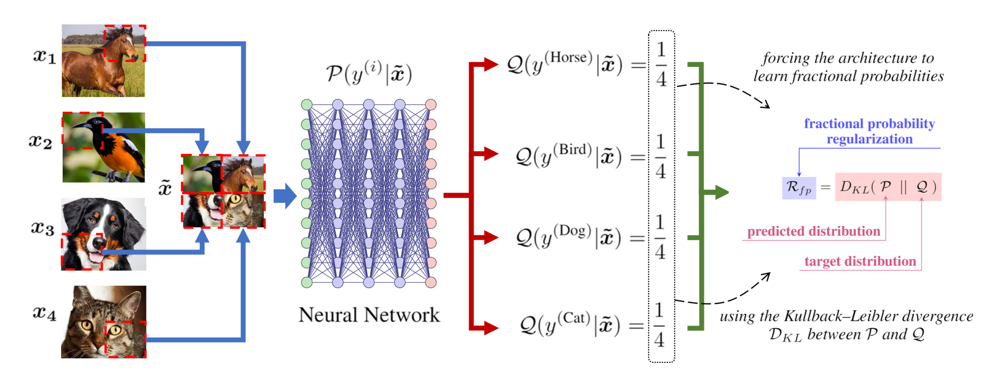

# **Visit "The Robust Deep Learning Library" (our newest work) to quickly use this loss and much more:**

# **[The Robust Deep Learning Library](https://github.com/dlmacedo/robust-deep-learning)**

---



# Distinction Maximization Loss (DisMax)

## Efficiently Improving Out-of-Distribution Detection and Uncertainty Estimation by Replacing the Loss and Calibrating

>>**We keep single network inference efficiency. No hyperparameter tuning. We need to train only once. SOTA.**

>>**Read the full paper: [Distinction Maximization Loss: Efficiently Improving Out-of-Distribution Detection and Uncertainty Estimation by Replacing the Loss and Calibrating](https://arxiv.org/abs/2205.05874).**

>>**Visit also the repository of our previous work: [Entropic Out-of-Distribution Detection](https://github.com/dlmacedo/entropic-out-of-distribution-detection).**

>> ## **Train on CIFAR10, CIFAR100, and ImageNet.**


___

# Use DisMax in your project!!!

## Replace the SoftMax loss with the DisMax loss changing few lines of code!

### Replace the model classifier last layer with the DisMax loss first part:

```python
class Model(nn.Module):
    def __init__(self):
    (...)
    #self.classifier = nn.Linear(num_features, num_classes)
    self.classifier = losses.DisMaxLossFirstPart(num_features, num_classes)
```

### Replace the criterion by the DisMax loss second part:

```python
model = Model()
#criterion = nn.CrossEntropyLoss()
criterion = losses.DisMaxLossSecondPart(model.classifier)
```

### Preprocess before forwarding in the training loop:

```python
# In the training loop, add the line of code below for preprocessing before forwarding.
inputs, targets = criterion.preprocess(inputs, targets) 
(...)
# The code below is preexistent. Just keep the following lines unchanged!
outputs = model(inputs)
loss = criterion(outputs, targets)
```

## Detect during inference:

```python
# Return the score values during inference.
scores = model.classifier.scores(outputs) 
```

## Run the example:

```
python example.py
```

___

# Code

## Software requirements

Much code reused from [deep_Mahalanobis_detector](https://github.com/pokaxpoka/deep_Mahalanobis_detector), [odin-pytorch](https://github.com/facebookresearch/odin), and [entropic-out-of-distribution-detection](https://github.com/dlmacedo/entropic-out-of-distribution-detection).

### Please, install all package requirments runing the command bellow:

```bash
pip install -r requirements.txt
```

## Preparing the data

### Please, move to the `data` directory and run all the prepare data bash scripts:

```bash
# Download and prepare out-of-distrbution data for CIFAR10 and CIFAR100 datasets.
./prepare_cifar.sh
# Download and prepare out-of-distrbution data for ImageNet.
./prepare_imagenet.sh
```

## Reproducing the experiments

### Train and evaluate the classification, uncertainty estimation, and out-of-distribution detection performances:

```bash
./run_cifar100_densenetbc100.sh*
./run_cifar100_resnet34.sh*
./run_cifar100_wideresnet2810.sh*
./run_cifar10_densenetbc100.sh*
./run_cifar10_resnet34.sh*
./run_cifar10_wideresnet2810.sh*
./run_imagenet1k_resnet18.sh*
```

## Analizing the results

### Print the experiment results:

```bash
./analize.sh
```

# Citation

Please, cite our papers if you use our loss in your works:

```bibtex
@article{macedo2022distinction,
  title={Distinction Maximization Loss: Efficiently Improving
  Out-of-Distribution Detection and Uncertainty Estimation
  by Replacing the Loss and Calibrating}, 
  author={David Macêdo and Cleber Zanchettin and Teresa Ludermir},
  year={2022},
  eprint={2205.05874},
  archivePrefix={arXiv},
  primaryClass={cs.LG}}
```
